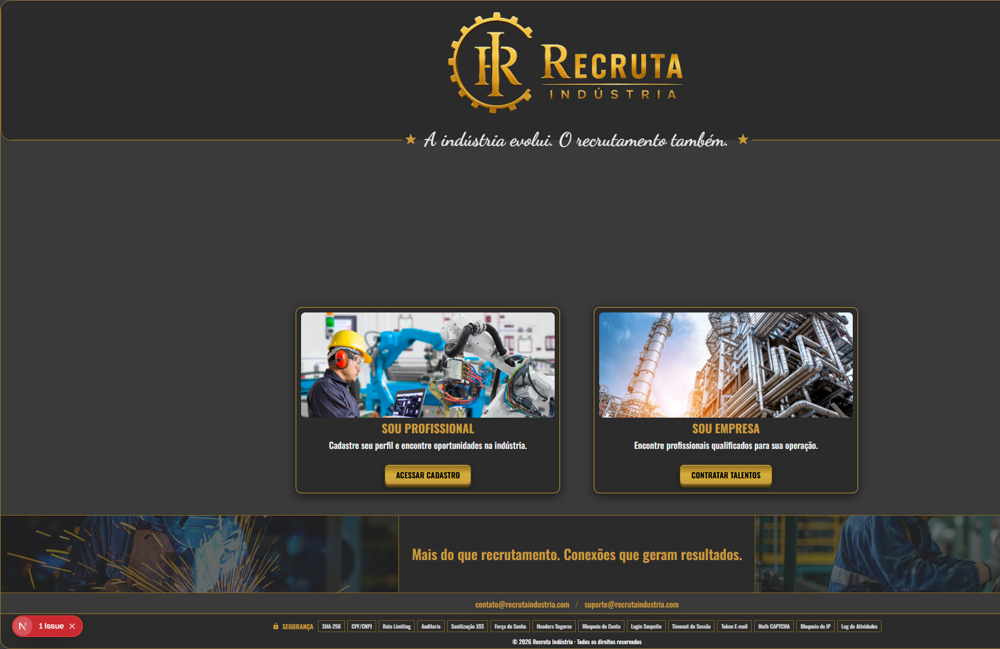
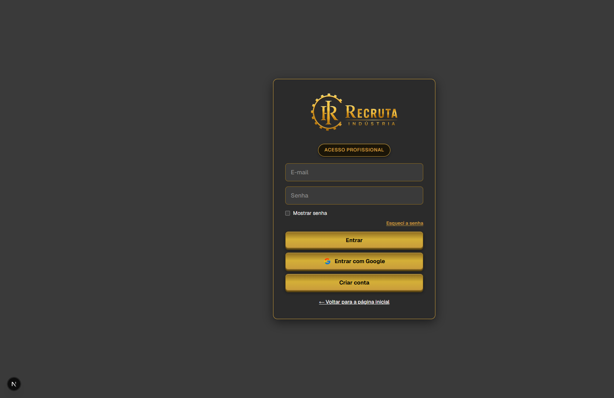
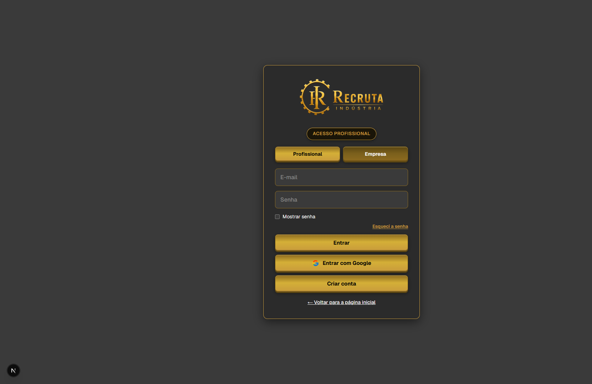
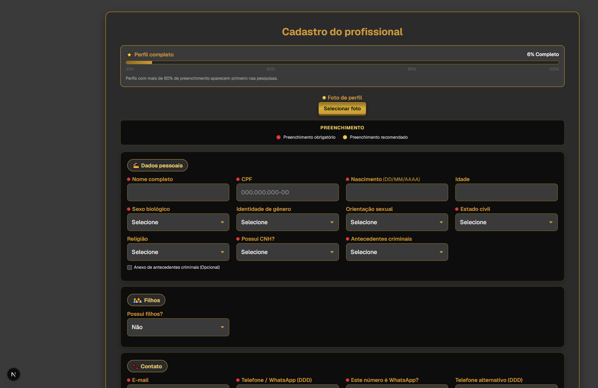
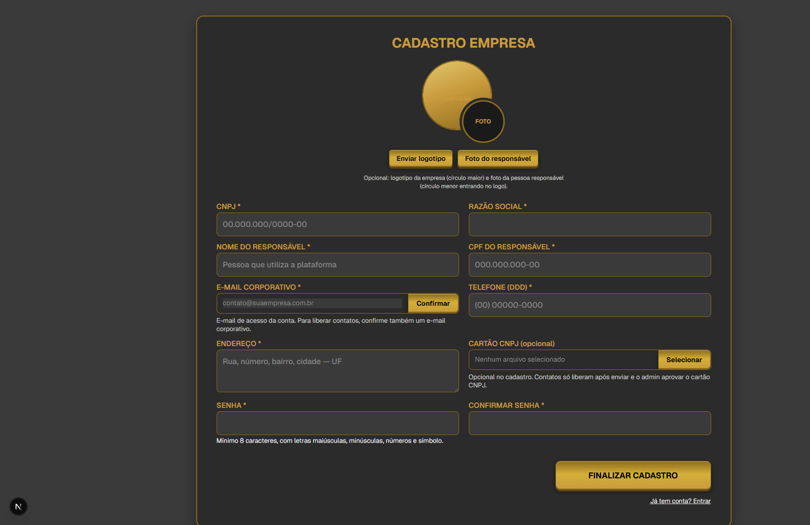
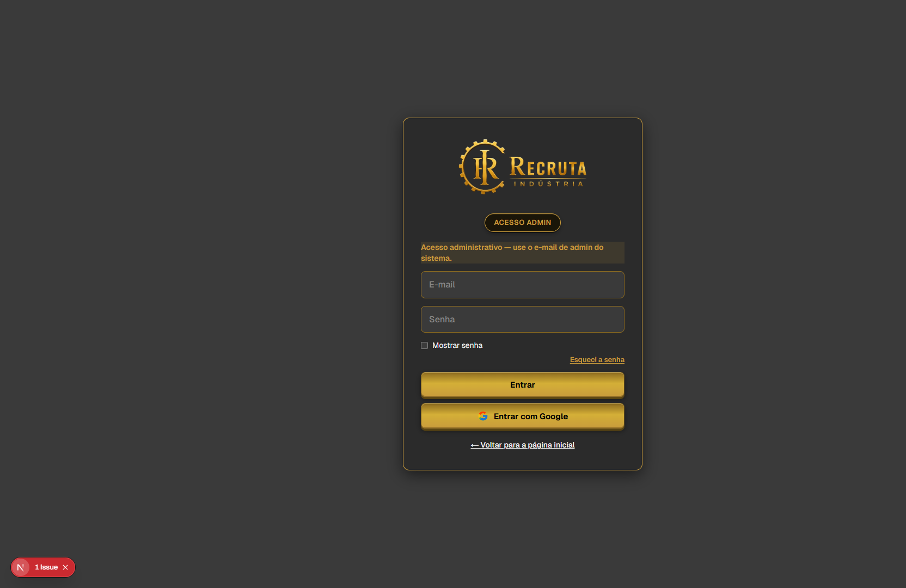

# Recruta Indústria — Documentação completa de funcionalidades

**Versão do documento:** 12/07/2026  
**Produto:** plataforma de recrutamento industrial (vitrine de profissionais + funil de contratação para empresas)  
**Status das páginas:** 🔒 **bloqueadas** (regra Cursor `site-pages-lock.mdc` + locks de home, login e dashboards)

Este arquivo inventaria o que foi implementado no site e inclui capturas das telas principais.

---

## 1. Stack

| Camada | Tecnologia |
|--------|------------|
| App | Next.js 16 (App Router), React 19, TypeScript |
| Auth | NextAuth v4 (e-mail/senha + Google) |
| Banco | PostgreSQL + Prisma |
| Mídia | Supabase (uploads privados, vídeo, URLs assinadas) |
| Pagamentos | PagSeguro / PagBank (PIX, boleto, cartão) |
| Segurança | Middleware (IP, rate limit, headers), bcrypt, CAPTCHA matemático, 2FA admin |
| PWA | Manifest + Service Worker + prompt de instalação |

---

## 2. Páginas bloqueadas (não editar sem pedido explícito)

Todas as rotas de UI em uso estão congeladas. Exemplos de frases que **liberam** edição: “desbloqueie o site”, “altere a home”, “mude o dashboard empresa”.

| Área | URLs |
|------|------|
| Home | `/` |
| Login / senha | `/login`, `/esqueci-senha`, `/reset-password` |
| Termos | `/termos/[slug]` |
| Profissional | `/professional/**` |
| Empresa | `/company/**` |
| Pagamento | `/pagamento` |
| Admin | `/admin`, `/admin/**`, `/admin-verify-2fa` |

Arquivos de regra: `.cursor/rules/site-pages-lock.mdc`, `home-page-lock.mdc`, `login-page-lock.mdc`, `dashboard-page-lock.mdc`, `logo-padrao.mdc`.

---

## 3. Telas capturadas

Imagens em `docs/screenshots/`.

### 3.1 Home (`/`)

Marca hero, dois CTAs (profissional / empresa), banner, contatos e selos de segurança.



### 3.2 Login profissional (`/login?tipo=profissional`)

Tag “Acesso Profissional”, e-mail/senha, Google, criar conta.



### 3.3 Login empresa (`/login?tipo=empresa`)

Tag “Acesso Empresa”, mesmo formulário unificado sem abas.


### 3.4 Login com abas (`/login`)

Quando não há `?tipo=`, as abas Profissional / Empresa ficam visíveis.



### 3.5 Cadastro profissional (`/professional/register`)

Formulário completo com barra de completude, seções em moldura dourada (dados pessoais, filhos, contato, localização, formação, perfil industrial, máquinas, qualidade, informática, apresentação, currículo, vídeo, termos).



### 3.6 Cadastro empresa (`/company/register`)

CNPJ, razão social, responsável, e-mail corporativo com confirmação, logo/foto, cartão CNPJ, senha.



### 3.7 Admin — porta de entrada (`/admin` → login)

Sem sessão admin, a rota redireciona para login com tag **Acesso Admin**.



### 3.8 Telas autenticadas (pendentes de captura com sessão)

As telas abaixo exigem login com conta válida. Não foi possível capturá-las nesta geração (sessão de teste incompleta / sem credenciais de empresa e admin no browser automatizado):

| Tela | URL | Arquivo previsto |
|------|-----|------------------|
| Dashboard profissional | `/professional/dashboard` | `05-dashboard-profissional.png` |
| Dashboard empresa | `/company/dashboard-empresa` | `06-dashboard-empresa.png` |
| Perfil aberto do profissional | `/company/professional/[id]` | `07-perfil-profissional.png` |
| Painel admin (logado) | `/admin` | `08-admin-painel.png` |

**Como completar:** faça login no browser do Cursor como profissional (perfil completo), empresa e admin, e peça para capturar essas quatro telas.

---

## 4. Identidade visual

- Logo oficial: `<LogoRecruta />` / `<LogoRecrutaSymbol />` (`public/logo-recruta.png`, `public/simbolo-recruta.png`)
- Tema dark industrial + dourado (`--ri-dourado`, molduras 2px)
- Botões 3D dourados (`lib/button-3d.ts`)
- Dashboards: `lib/ui/dashboard-theme.tsx` + `styles/dashboard-theme.css` (cards, títulos e seções dourados)

---

## 5. Autenticação e segurança

- Login e-mail/senha + Google OAuth
- Rate limit de login, bloqueio por tentativas, CAPTCHA após abuso
- Reset de senha por token (`/esqueci-senha`, `/reset-password`)
- Verificação de e-mail no cadastro; validação de CPF
- Headers de segurança, bloqueio de IP no middleware
- Admin por `ADMIN_EMAILS` / `isAdmin` + **2FA** (`/admin-verify-2fa`)
- Uploads privados com URL assinada (`/api/media/sign`)
- Auditoria (`SecurityAuditLog`)

---

## 6. Fluxo profissional

```
Home → Login ou Cadastro → boas-vindas → [checkout/pagamento] → dashboard
     → teste comportamental → propostas / entrevistas / arquivadas → video call
```

### Cadastro

- Dados pessoais, filhos, contato, localização (IBGE)
- Formação, cursos, certificações, idiomas
- Perfil: situação, área, nível, cargo, turno, pretensão
- Experiência na indústria + máquinas/equipamentos + qualidade + informática
- Apresentação / sobre mim, currículo PDF/DOCX, vídeo até 30s
- Termos: autorização de dados, veracidade, LGPD
- Completude `profileCompletion` (prioridade na busca acima de 80%)

### Dashboard (`/professional/dashboard`)

- Resumo + completude do perfil
- Visualizações da semana (Premium vê nomes das empresas)
- Teste comportamental (IPP) + resultado
- Histórico de recrutamento
- Dicas e mensagens
- Quadro de oportunidades: propostas, entrevistas, **arquivadas** (lista horizontal + excluir)
- Receber **chamada de vídeo** na plataforma
- Upgrade Premium / assinatura
- Heartbeat de presença online

### Planos profissional

| Plano | Destaques |
|-------|-----------|
| Gratuito | Vitrine, dicas/mensagens, contagem de visualizações |
| Premium (~R$ 19,90/mês) | Nomes das empresas que visualizaram, destaque, relatórios, e-mail |

---

## 7. Fluxo empresa

```
Home → Login ou Cadastro → e-mail corporativo → verificação admin → [pagamento]
     → dashboard busca → perfil candidato → proposta / entrevista / call / favoritos
```

### Cadastro

- CNPJ, razão social, responsável, CPF, telefone, endereço
- Logo + foto do responsável
- Cartão CNPJ (liberação de contatos após aprovação admin)
- E-mail corporativo com confirmação
- Status: `PENDING` | `VERIFIED` | `REJECTED`

### Dashboard (`/company/dashboard-empresa`)

- Busca/vitrine com paginação e filtros industriais
- Índice de compatibilidade (%)
- Status **online** do candidato (bolinha)
- Favoritos, histórico de buscas, alertas (Premium+)
- **Banco de talentos** (Empresarial): listas padrão + custom
- Entrevistas agendadas
- Planos / recursos exclusivos por tier
- Contato Recruta Indústria
- Molduras e títulos dourados

### Perfil aberto (`/company/professional/[id]`)

- Visão resumida vs. completa (desbloqueio / AccessRecord)
- Favoritar, dica anônima, mensagem
- Proposta de vaga
- Agendar entrevista: presencial / Meet-Teams / **Pela plataforma (PLATFORM)**
- Chamada de vídeo (`PlatformVideoCall`: Chamar → Aceitar/Recusar → câmera; Sobrepor fixa a janela)
- Vídeo de apresentação (`SecureVideoPlayer`)
- Teste comportamental visível ao recrutador
- Funil: contatado, entrevistado, em teste, contratado, não contratado
- Listas do banco de talentos; exportação (Premium+)

### Planos empresa

| Plano | Ref. | Destaques |
|-------|------|-----------|
| FREE | R$ 0 | Busca, perfil resumido, filtros básicos, compatibilidade |
| BASIC | R$ 197/mês | Contatos, perfil completo, favoritos, propostas, dicas |
| PREMIUM | R$ 397/mês | Ilimitados, alertas, exportação PDF |
| EMPRESARIAL | R$ 997/mês | Banco de talentos com listas personalizadas |

---

## 8. Propostas, entrevistas e video calls

### Proposta

Status: `SENT` → `INTERESTED` | `MORE_INFO` | `DECLINED` → fluxo de entrevista.

### Entrevista (`JobInterview`)

- Tipos: `PRESENTIAL` | `ONLINE` | `PLATFORM`
- Status: `PENDING` | `CONFIRMED` | `DECLINED` | `CANCELLED`
- `PLATFORM` = vídeo pela Recruta (sem URL externa)

### Video call

- Modelo `VideoCallInvite`: RINGING → ACCEPTED / DECLINED / ENDED / MISSED
- APIs: `/api/calls`, `/api/calls/[id]`
- UI: `components/shared/PlatformVideoCall.tsx`

### Presença online

- `User.lastSeenAt` + `/api/presence/heartbeat` + `/api/presence`
- Online se visto nos últimos ~2 minutos
- UI: `OnlineStatusDot` (ao lado do favorito no perfil)

### Arquivadas (profissional)

Arquiva quando: proposta/entrevista recusada, contratado ou não contratado. Lista horizontal resumida com **Excluir**.

---

## 9. Pagamentos

- Gateway PagBank/PagSeguro: PIX (QR), boleto, cartão
- Páginas: `/pagamento`, `/professional/pagamento`, `/company/pagamento`, checkout/upgrade/subscription
- Webhook `/api/pagseguro/webhook` (+ polling em localhost)

---

## 10. Teste comportamental (IPP)

- Rota: `/professional/dashboard/teste-comportamental`
- Questionário com perfis (ex.: reflexivo, dinâmico, estável, relacional, explorador)
- Resultado em `Profile.testeComportamentalJSON`
- Visão candidato + recrutador

---

## 11. Admin

| URL | Função |
|-----|--------|
| `/admin` | Centro de comando (métricas, visitas, planos) |
| `/admin/companies` | Empresas / verificação |
| `/admin/contato` | Inbox de contato |
| `/admin/servicos` (+ `[slug]`) | Serviços externos |
| `/admin/supabase`, `/vercel`, `/github`, `/google` | Atalhos |
| `/admin/security` | Locks, auditoria, unblock IP |
| `/admin-verify-2fa` | Desafio 2FA |

---

## 12. APIs por domínio (resumo)

- **Auth:** `/api/auth/*`, register, verify-email, password-reset, 2FA  
- **Profissional:** profile, tips, messages, proposals, funnel, teste-comportamental, video-apresentacao, profile-views, subscription  
- **Empresa:** professionals, favorites, alerts, talent-lists, tips, messages, proposals, interviews, dashboard-stats, corporate-email  
- **Presença / calls:** `/api/presence`, `/api/presence/heartbeat`, `/api/calls`  
- **Pagamento:** `/api/pagseguro/*`, `/api/payment/*`  
- **Admin:** stats, inbox, companies/verify, security/*, list/delete users  
- **Outros:** analytics/visit, upload, media/sign  

---

## 13. Modelo de dados (entidades centrais)

`User`, `Company`, `Professional`, `Profile`, `JobProposal`, `JobInterview`, `VideoCallInvite`, `CompanyFavorite`, `CompanyTalentList`, `CompanyAlert`, `CompanySearchHistory`, `CompanyProfileTracking`, `ProfileView`, `AccessRecord`, `Tip`, `ProfileMessage`, `PaymentRecord`, `EmailVerification`, `CorporateEmailConfirmation`, `SiteVisit`, `SecurityAuditLog`

---

## 14. Componentes de produto (principais)

| Área | Componentes |
|------|-------------|
| Empresa | `CompanyDashboardTools`, `CompanyPlanCards`, `CompanyCandidateProfilePanel`, `PropostasEntrevistasEmpresa`, `BandeiraFavoritoIcon` |
| Profissional | `ProfessionalOpportunityBoard`, `VideoApresentacao*`, `CarreiraTimeline` |
| Shared | `PlatformVideoCall`, `OnlineStatusDot`, `SecureVideoPlayer` |
| Marca | `LogoRecruta`, `LogoRecrutaSymbol` |

---

## 15. Incrementos recentes (destaque)

1. **Molduras e títulos dourados** nos dashboards e perfis  
2. **Presença online** (heartbeat + bolinha)  
3. **Chamada de vídeo na plataforma** (Chamar / Aceitar / Recusar / Sobrepor)  
4. **Entrevista “Pela plataforma”** (`PLATFORM`)  
5. **Arquivadas** em lista horizontal com exclusão  
6. **Bloqueio total das páginas** via regras Cursor (12/07/2026)  

---

## 16. Fluxo ponta a ponta

```
Home
 ├─ Profissional: register → termos → vídeo → boas-vindas → [pagamento] → dashboard
 │                 → IPP → propostas/entrevistas/arquivadas → receber call
 └─ Empresa: register → e-mail corporativo → verify admin → [plano]
              → busca → perfil → favorito/proposta/entrevista PLATFORM/call
              → banco de talentos / alertas (por plano)
Admin: login autorizado → 2FA → métricas / empresas / segurança / serviços
```

---

*Documento gerado a partir do código do repositório e capturas locais em `docs/screenshots/`. Páginas autenticadas restantes devem ser anexadas após login manual no ambiente de desenvolvimento.*
